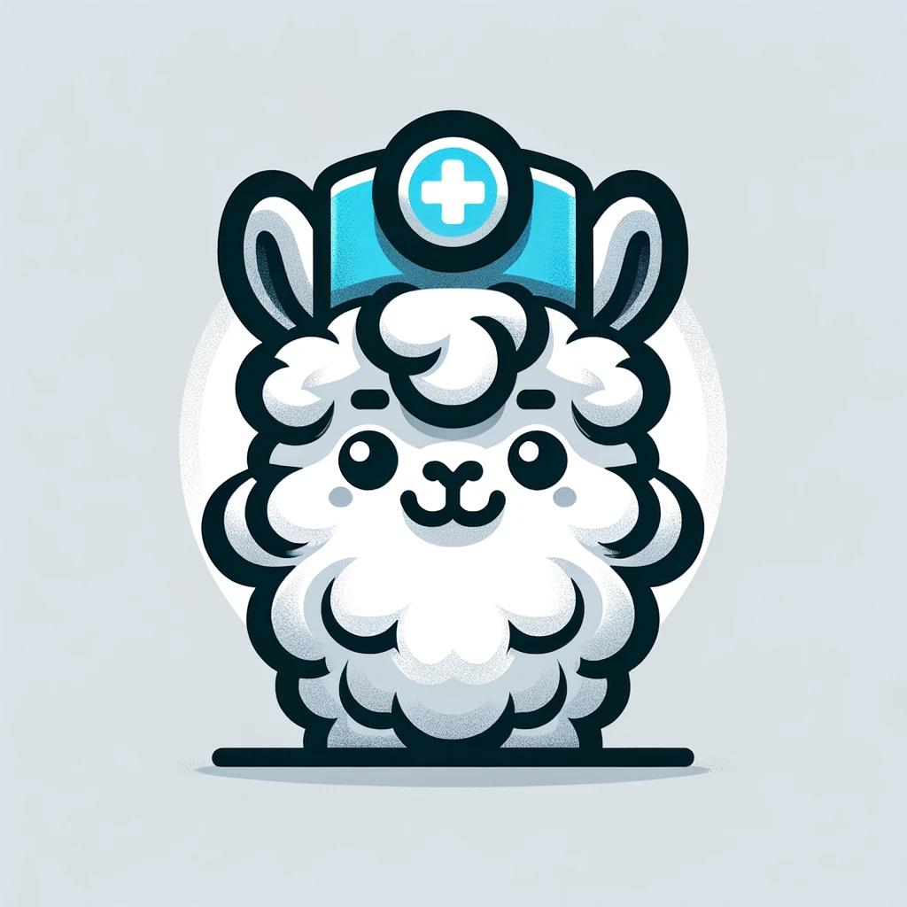
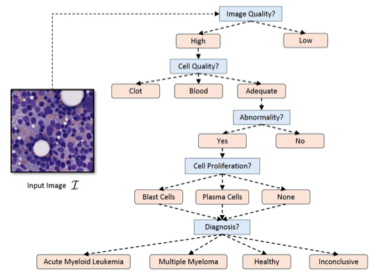
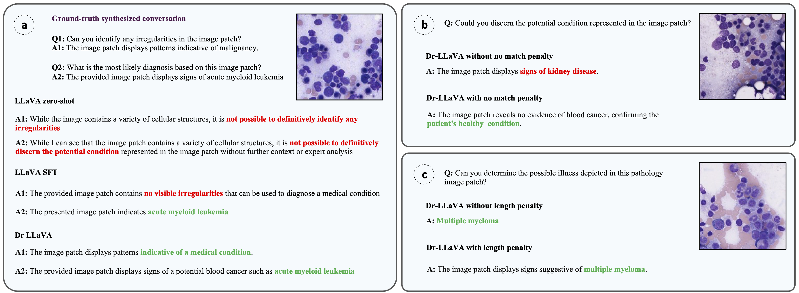

<div align="center">
    
    <p>Generated by <a href="https://openai.com/dall-e-3">DALL·E 3</a></p>
</div>

<div align="center">
    <h1>Dr-LLaVA: Visual Instruction Tuning with Symbolic Clinical Grounding</h1>
</div>

**Dr-LLaVA** is a conversational Visual Language Model (VLM) fine-tuned for analyzing medical images. 
Developed to reduce inconsistency across medical diagnostic conversations, it employs a novel alignment algorithm utilizing **symbolic representations** of clinical reasoning to ground VLMs in medical knowledge. Using a rule-based system, instead of a trained reward model or large language model, this method is more memory efficient and straightforward to understand.
However, because we employed a rule-based reward model system that utilizes conditions based on the existence or absence of key words to optimize the model, each model designed to address a specific medical knowledge hallucination problem requires a distinct rule-based reward model.

Dr-LLaVA was trained on 4 A100 GPUs with 80GB memory. For training on fewer GPUs, reduce the per_device_train_batch_size and increase the gradient_accumulation_steps accordingly, maintaining the same global batch size: `per_device_train_batch_size` x `gradient_accumulation_steps` x `num_gpus`.

Dr-LLaVA has four steps.

1. **Curate the Dataset and Initialize the Policy Model with Supervised Fine-tuning**
2. **Construct Symbolic Representations of Clinical Reasoning**
    - Utilize these representations to generate GPT-4-guided visual instruction tuning data, simulating clinician-VLM conversations with demonstrations of clinical reasoning.
3. **Create an Automatic Reward Function**
    - Evaluate the clinical validity of VLM outputs during clinician-VLM interactions.
4. **Train the RL Model with PPO**

## Setup

Refer to [`llava_setup`](../llava_setup) for instructions on setting up the customized LLaVA package.

Additionally, run the following command to ensure the versions of essential packages are correct:

```bash
pip install torch==2.0.1+cu118 torchvision==0.15.2+cu118 torchaudio==2.0.2 --index-url https://download.pytorch.org/whl/cu118
pip install deepspeed==0.9.3
pip install peft==0.4.0
pip install transformers==4.31.0
pip install bitsandbytes==0.41.0
pip install datasets
```

**Note:** Install PyTorch 2.0.1 following the guidelines [here](https://pytorch.org/get-started/previous-versions/#v201). The flash-attention implementation in the latest PyTorch Stable (2.1.0) may lead to buggy results. The codebase is tested with `torch==2.0.1+cu118`.

## Curate the Dataset and Supervised Fine-tuning of the LLaVA Model

### Curate the Sequential QA Dataset

Involve multi-round conversations with clinical grounding. A medical image with a known diagnosis must have other morphological features that clinicians identify prior to confirming the diagnosis.

For example:
1. Medical image -> 
2. Question about image description -> 
3. Question about image quality evaluation -> 
4. Question about morphological feature 1 -> 
5. Inference on feature 1 -> 
6. ... -> 
7. Question about morphological feature n -> 
8. Inference on feature n -> 
9. Diagnosis.

Starting with labeled medical images, we use symbolic representations of clinical reasoning and GPT models to generate realistic conversations between a VLM and a clinician about the visual content of each image. These multi-turn conversations reflect various styles of clinician-VLM interactions, demonstrating accurate clinical reasoning.

Refer to LLaVA's instruction tuning data [here](https://huggingface.co/datasets/liuhaotian/LLaVA-Instruct-150K/blob/main/llava_v1_5_mix665k.json) to prepare the data in the correct format.

### Supervised Fine-tuning of the LLaVA Model

Note: The RL component of the model will not function unless supervised fine-tuning is performed. This method is designed to address the issue of medical knowledge hallucination, which frequently occurs during supervised fine-tuning when the model attempts to produce diagnoses but remains inconsistent across conversations. The RL component will not operate in a zero-shot manner, where an unfine-tuned model does not attempt to perform medical diagnosis.

After curating the dataset and and storing the training and test data in the LLaVA.json format, please download the the 7b SFT model checkpoint from [`LLaVA-RLHF-7b-v1.5-224`](https://huggingface.co/zhiqings/LLaVA-RLHF-7b-v1.5-224) for supervised fine tuning, you can run the following script to initialize the policy model:
run:


```bash
cd RLHF/
bash scripts/7b-v1.5-224/initialize_policy_model.sh
```

## Build the Rule-Based Reward Model

### Construct Symbolic Representations of Clinical Reasoning

Given a question about a medical image, there are limited valid responses, including an option for insufficient information. Responses can be constructed into categorical values projected onto a logical graph tree, similar to the example below for blood malignancies.

<div align="center">
    
</div>

### Develop Your Clinical Logic for Medical Diagnosis

Refer to our [manuscript](https://www.arxiv.org/abs/2405.19567) for details on constructing the logic for hematology image diagnosis. For more examples, see the [Example_Clinical_Logics.md](assets/Example_Clinical_Logics.md) file.

Afterward, augment the QAs with available large language models to increase the diversity of QAs.

## Using Clinical Logics to Construct the Reward Model

To build your reward model, refer to the class `RewardModel_HEME` in the file `RLHF/models/reward_model.py` at line 444. The `RewardModel_Custom` class provides a template for creating a reward model based on clinical logic. Customize the logic and rules according to your requirements.

## Training the RL Model with PPO

Run:

```bash
cd RLHF/
bash scripts/7b-v1.5-224/train_rl_model.sh
```

## Examples

<div align="center">
    
</div>

## Citations

If you find this repo useful for your research, please consider citing our papers:

**Dr-LLaVA:**

```bibtex
@article{sun2024dr,
  title={Dr-LLaVA: Visual Instruction Tuning with Symbolic Clinical Grounding},
  author={Sun, Shenghuan and Goldgof, Gregory M and Schubert, Alexander and Sun, Zhiqing and Hartvigsen, Thomas and Butte, Atul J and Alaa, Ahmed},
  journal={arXiv preprint arXiv:2405.19567},
  year={2024}
}
```

**LLaVA-RLHF:**

```bibtex
@article{sun2023aligning,
  title={Aligning large multimodal models with factually augmented rlhf},
  author={Sun, Zhiqing and Shen, Sheng and Cao, Shengcao and Liu, Haotian and Li, Chunyuan and Shen, Yikang and Gan, Chuang and Gui, Liang-Yan and Wang, Yu-Xiong and Yang, Yiming and others},
  journal={arXiv preprint arXiv:2309.14525},
  year={2023}
}
```

**LLaVA:**

```bibtex
@misc{liu2023llava,
  title={Visual Instruction Tuning},
  author={Liu, Haotian and Li, Chunyuan and Wu, Qingyang and Lee, Yong Jae},
  publisher={arXiv:2304.08485},
  year={2023},
}
```

**SALMON:**

```bibtex
@article{sun2023salmon,
  title={SALMON: Self-Alignment with Principle-Following Reward Models},
  author={Sun, Zhiqing and Shen, Yikang and Zhang, Hongxin and Zhou, Qinhong and Chen, Zhenfang and Cox, David and Yang, Yiming and Gan, Chuang},
  journal={arXiv preprint arXiv:2310.05910},
  year={2023}
}
```

## Acknowledgements

We thank [Meta LLaMA team](https://github.com/facebookresearch/llama), [Stanford Alpaca team](https://github.com/tatsu-lab/stanford_alpaca), [Vicuna team](https://github.com/lm-sys/FastChat), [LLaVA team](https://github.com/haotian-liu/LLaVA), [QLoRA team](https://github.com/artidoro/qlora), [Hugging Face PEFT](https://github.com/huggingface/peft), and [AlpacaFarm team](https://github.com/tatsu-lab/alpaca_farm) for their open-source efforts in democratizing large language models.
